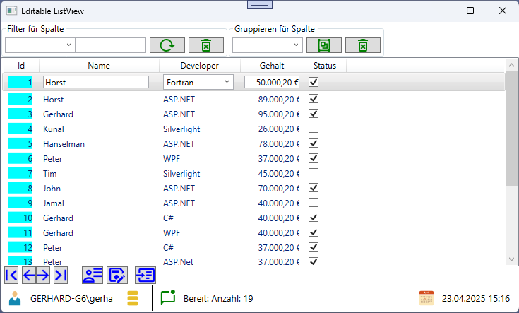
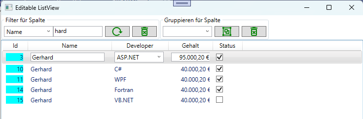

# EditableListView


]

ListView mit editierbare Columns (wie TextBox, CheckBox, ComboBox, usw.). Grundsätzlich ist das ListView nur zur Darstellung von Daten ausgelegt. Durch Verwendung von **DataTemplate** können editierbare Control eingesetzt werden.</br>
In dem Beispiel werden folgende Features gezeigt:
- Filtern von Daten
- Gruppieren von Daten
- Spaltensortierung
- Lesen und speicben des Inhalts in eine JSON Datei
- Navigation Innerhalb des ListView
- Benachrichtigung von Änderungen in einer Zelle 

</br>


Die Spalten des Listview werden mit einem Binding zwischen dem DateTemplate und einer Liste (als ObservableCollection) behandelt.
Als Liste wird als eine Abteilung einer **ObservableCollection** => **NotifyObservableCollection** Diese Eigenimplemntierung dient nicht nur der Überwachung was mit einer Row passiert, sondern stellt zusätzlich die Überwachnung der Spalten zur Verfügung.</br>
So kann eben auch die Änderung des Zelleninhalts direkt dargestellt werden.

## Filtern

Ein Filter für ein ListeView kann als Lamda-Ausdruck erstellt, oder innerhalb einer Methode implemeniert werden.
Es kann auch eine Art *Google-Filter* erstellt werden, in dem die Werte alle Properties in einem zu durchsuchenden String zusammengefügt und dargestellt werden.

```csharp
this.ListViewSource.Filter = item =>
{
    ViewItem vitem = item as ViewItem;
    if (vitem == null)
    {
        return false;
    }

    PropertyInfo info = item.GetType().GetProperty(cmbProperty.Text);
    if (info == null)
    {
        return false;
    }

    return info.GetValue(vitem, null).ToString().ToLower().Contains(this.txtFilter.Text.ToLower());
};
```
Da die Suchen mit *Contains()* erstellt wurde, können auch Teilstrings gesucht werden. Gruß- oder Kleinschreibung wird ignoriert.
</br>
</br>
</br>
## Gruppierung

## Navigation


